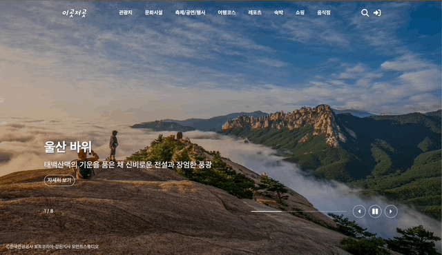
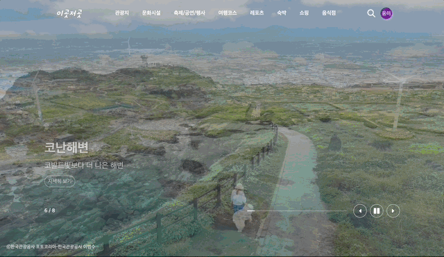
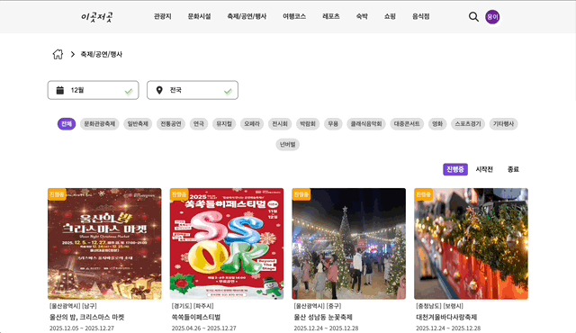
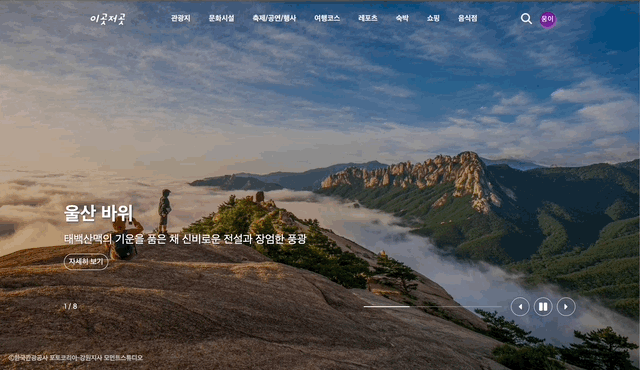

# 이곳저곳

"복잡한 정보 속에서 찾은 나만의 국내 여행지" > 공공데이터 API를 활용한 직관적인 국내 관광 정보 서비스

<a href="https://igotjeogot.kr" rel='noreferrer' target="_blank" >이곳저곳으로 이동</a>
  

### 💡 개발 배경 및 목적

평소 국내 여행을 즐기며 '대한민국 구석구석'과 같은 포털에서 정보를 얻곤 했지만, 방대한 정보량에 비해 복잡한 UI로 인해 원하는 정보를 빠르게 찾기 어렵다는 아쉬움이 있었습니다. 이러한 불편함을 해소하고자 1만 개 이상의 관광 데이터를 사용자가 한눈에 파악할 수 있도록 직관적으로 재구성하고, 검색과 커뮤니티 등 핵심 기능에 집중한 미니멀 관광 플랫폼 '이곳저곳'을 기획하게 되었습니다.

단순한 화면을 구현하는 것에 그치지 않고, 프론트엔드 중심의 Full-cycle 개발(설계, 빌드, 배포, 운영)을 직접 경험하며 실무 환경에서 필요한 문제 해결 역량과 전체적인 서비스 흐름을 이해하는 것을 최종 목표로 삼았습니다.
  

### 🛠 기술 스택
<table>
  <thead>
    <tr>
      <th>Category</th>
      <th>Stack</th>
    </tr>
  </thead>
  <tbody>
    <tr>
      <td align="center"><b>Languages</b></td>
      <td>
        
        
        
        
      </td>
    </tr>
    <tr>
      <td align="center"><b>Frontend</b></td>
      <td>
        
        
        
      </td>
    </tr>
    <tr>
      <td align="center"><b>Backend & DB</b></td>
      <td>
        
        
        
      </td>
    </tr>
  </tbody>
</table>

##### 💡 Firebase Firestore (NoSQL), Firebase Functions (Node.js)
 

### ✨ 주요 기능

<table width="100%">
  <tbody>
    <tr>
      <td width="50%" align="center" ><b>소셜 로그인</b></th>
      <td width="50%" align="center" ><b>검색 및 필터링</b></th>
    </tr>
    <tr>
      <td align="center">
        
      </td>
      <td align="center">
        
      </td>
    </tr>
    <tr>
      <td align="center"><b>댓글 및 커뮤니티</b></td>
      <td align="center"><b>사용자 기록 관리</b></td>
    </tr>
    <tr>
      <td align="center">
        
      </td>
      <td align="center">
        
      </td>
    </tr>
  </tbody>
</table>

### 업데이트 내역

<a href='https://github.com/UngMon/react-festival/blob/main/Patchhistoty.md' rel='noreferrer'>업데이트 내역으로 이동</a>
  

### 📚 프로젝트 회고

🎨 "디자인보다 사용자 경험(UX)에 집중하다"
프로젝트 초기, 전문 디자인 역량의 한계를 '벤치마킹과 단순화'로 극복하고자 했습니다. '방대한 데이터를 어떻게 하면 직관적으로 보이게 할 것인가'에 초점을 맞추고 다양한 사이트를 참고하여 복잡한 레이아웃 대신, 사용자에게 익숙한 현대적 플랫폼의 UI 패턴을 분석하고 적용했습니다. '심심함'이 아닌 '명확함'을 목표로, 카드 타입의 레이아웃과 직관적인 네비게이션을 설계하여 정보 접근성을 높였습니다.

🧩 "확장성을 고려한 컴포넌트 설계의 중요성"
기능이 추가될수록 기존 코드를 수정해야 하는 리팩토링 비용이 발생하며 코드 설계의 중요성을 체감했습니다. 단순히 화면을 그리는 것을 넘어, **재사용 가능한 컴포넌트, 유틸 함수, Custom Hook**으로 로직을 분리하는 연습을 했습니다. 특히 댓글과 답글 등 반복되는 로직을 모듈화함으로써 새로운 기능을 추가할 때 기존 코드를 레고 블록처럼 조합하여 개발 속도를 획기적으로 단축할 수 있었습니다.

🌐 "프론트엔드 개발자로서의 협업 관점 확보"
Serverless(Firebase) 환경을 직접 구축하며 백엔드와의 소통 방식을 배웠습니다. 데이터 구조(NoSQL)를 직접 설계하면서 API 호출 효율성을 고민하며, 프론트엔드 팀이 백엔드 팀과 어떤 지점에서 기술적 타협점을 찾아야 하는지(예: API 페이로드 최적화, 에러 핸들링)를 간접 경험했습니다. 이 과정은 실무에서 UI/UX 디자이너, 백엔드 개발자와 원활하게 소통할 수 있는 소중한 밑거름이 되었습니다.
